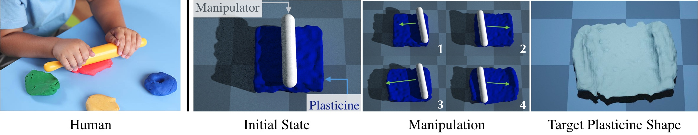
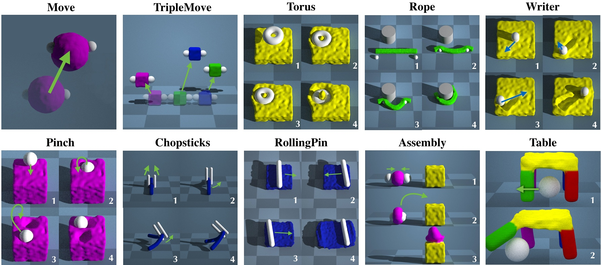
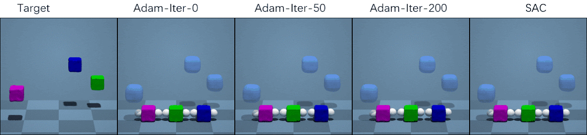

# PlasticineLab: A Soft-Body Manipulation Benchmark with Differential Physics

[Zhiao Huang](https://sites.google.com/view/zhiao-huang), [Yuanming Hu](https://yuanming.taichi.graphics/), [Tao Du](https://people.csail.mit.edu/taodu/), [Siyuan Zhou](https://openreview.net/profile?id=~Siyuan_Zhou2), [Hao Su](https://cseweb.ucsd.edu/~haosu/), [Joshua B. Tenenbaum](http://web.mit.edu/cocosci/josh.html), [Chuang Gan](https://people.csail.mit.edu/ganchuang/)

## Abstract

Simulated virtual environments serve as one of the main driving forces behind developing and evaluating skill learning algorithms. However, existing environments typically only simulate rigid body physics. Additionally, the simulation process usually does not provide gradients that might be useful for planning and control optimizations. We introduce a new differentiable physics benchmark called PasticineLab, which includes a diverse collection of soft body manipulation tasks. In each task, the agent uses manipulators to deform the plasticine into a desired configuration. The underlying physics engine supports differentiable elastic and plastic deformation using the DiffTaichi system, posing many underexplored challenges to robotic agents. We evaluate several existing RL methods and gradient-based methods on this benchmark. Experimental results suggest that 1) RL-based approaches struggle to solve most of the tasks efficiently; 2) gradient based approaches, by optimizing open-loop control sequences with the built-in differentiable physics engine, can rapidly find a solution within tens of iterations, but still fall short on multi-stage tasks that require long-term planning. We expect that PlasticineLab will encourage the development of novel algorithms that combine differentiable physics and model-based RL for more complex physics-based skill learning tasks. PlasticineLab will be made publicly available. 

## Tasks

## Examples

### Move

### TripleMove

### Rope

### Writer

### Chopsticks

### Torus

### Pinch

### Table

### Assembly

### RollingPin

## Related Papers

Having trouble with Pages? Check out our [documentation](https://docs.github.com/categories/github-pages-basics/) or [contact support](https://support.github.com/contact) and we’ll help you sort it out.
